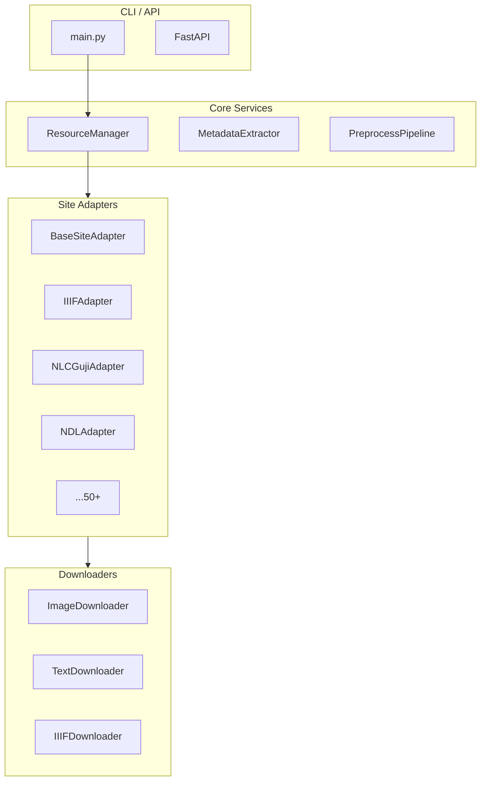

# Guji Resource Manager (古籍资源管理器)

A Python service for downloading and processing ancient Chinese book (古籍) resources from 50+ digital library websites.

## Background

- **bookget**: Go-based tool supporting 50+ digital libraries (IIIF and custom APIs)
- **guji-resource-index**: 55 website analysis docs with API specs and field mappings
- **Preprocessing examples**: `parse_to_json.py` and `json_to_tex.py` for content transformation

## Goals

| Goal | Description | bookget |
|------|-------------|:-------:|
| 图片资源下载 | Download images from 50+ sites | ✅ |
| 文字资源下载 | Download OCR/transcription text | ❌ |
| 元数据提取 | Extract book info, version details | ⚠️ |
| 预处理管道 | Parse, transform, clean content | ❌ |
| 平台集成 | Integrate with `book_index_manager` | ❌ |

---

## Architecture



---

## Project Structure

```
bookget/
├── __init__.py
├── __main__.py                # python -m entry
├── main.py                    # CLI implementation
├── config.py                  # Configuration
├── exceptions.py              # Custom exceptions
├── logger.py                  # Logging setup
│
├── core/
│   └── resource_manager.py    # Main orchestrator
│
├── adapters/                  # Site-specific adapters
│   ├── base.py                # BaseSiteAdapter ABC
│   ├── registry.py            # Adapter auto-discovery
│   ├── iiif/
│   │   ├── base_iiif.py       # Base IIIF adapter
│   │   ├── harvard.py         # Harvard Library
│   │   └── ndl.py             # 国立国会図書館
│   └── chinese/
│       ├── nlc_guji.py        # 中华古籍智慧化服务平台
│       └── ctext.py           # 中国哲学书电子化计划
│
├── downloaders/
│   └── base.py                # Image/Text downloaders
│
├── models/
│   └── book.py                # BookMetadata, Resource
│
├── storage/
│   └── file_storage.py        # File system operations
│
└── preprocessing/             # Future: parse, transform, clean
    ├── pipeline.py
    ├── parsers/
    └── transformers/
```

---

## Key Interfaces

### BaseSiteAdapter

```python
class BaseSiteAdapter(ABC):
    site_name: str = ""
    site_domains: List[str] = []
    supports_iiif: bool = False
    supports_text: bool = False
    
    @abstractmethod
    def can_handle(cls, url: str) -> bool: ...
    
    @abstractmethod
    async def get_metadata(self, book_id: str) -> BookMetadata: ...
    
    @abstractmethod
    async def get_image_list(self, book_id: str) -> List[Resource]: ...
    
    async def get_text_content(self, book_id: str) -> Optional[str]: ...
```

### BookMetadata Model

```python
@dataclass
class BookMetadata:
    id: str = ""              # Internal ID
    source_url: str = ""      # Original URL
    title: str = ""
    creators: List[Creator] = field(default_factory=list)
    dynasty: str = ""         # 朝代
    date: str = ""            # 出版年代
    category: str = ""        # 四部分类
    collection_unit: str = "" # 收藏单位
    # ... more fields
```

---

## CLI Usage

```bash
# Download from URL
python -m bookget download "https://guji.nlc.cn/..."

# With options
python -m bookget download "URL" \
    --output ./downloads \
    --concurrent 4

# Metadata only
python -m bookget metadata "URL" --format json

# List supported sites
python -m bookget sites --list

# Check URL support
python -m bookget sites --check "URL"
```

---

## Implementation Status

| Phase | Focus | Status |
|-------|-------|--------|
| 1 | Core infrastructure | ✅ Complete |
| 2 | Site adapters | ✅ 13 Adapters |
| 3 | Text resource support | ⏳ Pending |
| 4 | Preprocessing pipeline | ⏳ Pending |
| 5 | Full 50+ site coverage | ⏳ Pending |
| 6 | Integration & polish | ⏳ Pending |

### Registered Adapters (13)

**IIIF Sites:**
- ✅ Generic IIIF (any manifest)
- ✅ Harvard, Princeton, Stanford, Berkeley
- ✅ NDL (Japan)
- ✅ BnF Gallica, British Library, BSB (Europe)
- ✅ NCL Taiwan

**Custom API Sites:**
- ✅ 中华古籍智慧化服务平台 (NLC Guji)
- ✅ 识典古籍 (Shidianguji)
- ✅ 臺灣故宮博物院 (NPM Taipei)
