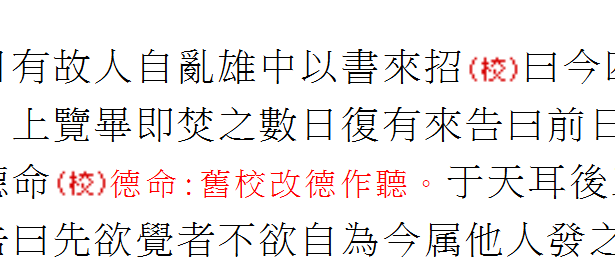

# 臺灣中央研究院歷史語言研究所 - 漢籍全文資料庫

臺灣中央研究院歷史語言研究所（史語所）自1984年起建設的全文电子资料库，是目前最具规模、资料统整最为严谨的中文全文资料库之一，内容按经、史、子、集四部分类，以史部为主。

- 网站链接：https://hanchi.ihp.sinica.edu.tw/
- 汉籍电子文献入口：https://hanji.sinica.edu.tw/
- 分享协议：分免费版与授权版（免费版可全球使用，授权版需机构或个人申请）
- 收录历代典籍 1,573 种，约 8.7 亿字
- 资源类型：全文文字资源（经史子集），包含二十五史、十三经注疏、佛教文献、古典小说、政书、类书等
- 不支持 IIIF 协议（纯文字资料库，无图片）
- **注意**：这是一个**文字全文**资料库，提供的是经过校勘的古籍文本，而非影印图片

## 搜索与浏览

- 免费版入口：https://hanchi.ihp.sinica.edu.tw/ihpc/ttswebquery?@hanjiquery
- 授权版入口：https://hanchi.ihp.sinica.edu.tw/ihpc/ttsweb?@hanji
- 支持多种检索方式：
  - **基本检索**：按书名、全文、注文三个字段搜索，支持异体字展开和同义词展开
  - **进阶检索**：多条件组合，支持布尔运算（AND / OR / NOT）
  - **专业检索**：距离检索，可指定两个检索词之间的字数间隔
  - **以文找文**：输入 20 字以上段落，按相似度（50%~100%）找出相似内容
  - **书目浏览**：按经、史、子、集四部层级分类浏览
- 免费版无需注册即可使用，但有同时连接数和带宽限制；30 分钟无操作会断线
- 授权版需机构域名认证或个人帐号

## 子资料库

漢籍全文資料庫包含多个子资料库（各有独立入口），以下为用户提供的示例所属的子库：

- **明實錄、朝鮮王朝實錄、清實錄資料庫**：三朝实录合作建置计划
  - 入口：https://hanchi.ihp.sinica.edu.tw/mqlc/hanjishilu?...@SPAWN
  - 收录：明实录、朝鲜王朝实录、清实录

## 每本书能看到什么

| 字段 | 说明 | 示例 |
|------|------|------|
| 书名 | 典籍名称 | 明實錄 |
| 分类路径 | 经/史/子/集的层级分类 | 史／編年／明實錄 |
| 出版项 | 出版信息（出版地、出版者、年代） | 臺北市：中央研究院歷史語言研究所，民55[1966] |
| 底本 | 所据版本来源 | 國立北平圖書館紅格鈔本微捲影印 |
| 校勘说明 | 校勘信息 | 中央研究院歷史語言研究所校勘 |
| 全文 | 完整的古籍文本（非图片） | 逐章节显示全文 |
| 注文 | 注释文字（部分典籍） | 可切换显示/隐藏 |

**补充说明**：
- 提供完整的全文文字（经过人工校勘录入，非 OCR）
- 部分典籍提供原书影像（PDF 格式），可通过页面上的「圖」链接查看
- 支持字体大小和行距调整
- 支持「友善列印」功能，生成便于打印/复制的纯文字页面
- 支持「内文并列比较」功能，可同时对照多段文字
- 人名可链接到传记资料（人名权威资料）
- 支持书签和笔记功能（需注册）

## 示例

以下示例来自「明實錄、朝鮮王朝實錄、清實錄」子资料库：

- 子资料库首页（含三本书的目录树）：https://hanchi.ihp.sinica.edu.tw/mqlc/hanjishilu?1:1440492097:10:/raid/ihp_ebook2/hanji/ttsweb.ini:::@SPAWN
- 书级页面（明实录全文首页）：https://hanchi.ihp.sinica.edu.tw/mqlc/hanjishilu?@1^1440492097^802^^^30211001@@427303010
- 章节页面（明实录·太祖·卷一·辛卯歲五月）：https://hanchi.ihp.sinica.edu.tw/mqlc/hanjishilu?@1^1440492097^802^^^60211001000500050002@@1795010443
- 友善列印页面（同一章节的纯文字版）：https://hanchi.ihp.sinica.edu.tw/mqlc/hanjishilu?@1^1440492097^810^^^60211001000500050002^N@@670924189

## 凡例

本工具从漢籍全文資料庫的 HTML 页面提取纯文字，提取过程中对各种 HTML 元素做如下转换：

### 保留内容

| HTML 原文 | 转换结果 | 说明 | 截图 |
|-----------|---------|------|------|
| `<div>辛卯夏五月汝潁兵起</div>` | 辛卯夏五月汝潁兵起 | 正文段落，每个 `<div>` 成为一段 | |
| `<h3><b>太祖高皇帝實錄序</b></h3>` | 太祖高皇帝實錄序 | 标题，提取为独立段落 | |
| `<a class=auth ...>人名</a>` | 人名 | 人名权威链接，保留文字、去掉链接 | |
| `<b>加粗</b>` `<i>斜体</i>` 等 | 加粗 / 斜体 | 格式标签（`<b>` `<i>` `<u>` `<em>` `<strong>` `<font>` `<sup>` `<sub>` 等），保留内文、去掉标签 | |
| `&amp;` `&lt;` `&gt;` | & < > | HTML 实体还原为原始字符 | |

### 校勘标记转换

| HTML 原文 | 转换结果 | 说明 | 网站截图 |
|-----------|---------|------|------|
| `` | (補) | 校勘标记：据他本补入的文字，半角括号|  |
| `` | (贅) | 校勘标记：衍文（多余的字），半角括号 |  |
| `<span id=q00>德命:舊校改德作聽。</span>` | 【德命:舊校改德作聽。】 | 校勘注释，转为全角方括号包裹 |  |
| `<font size=-2>臣</font>` | 〈臣〉 | 敬辞小字（原文缩小显示），转为尖角括号 |  |
| `<font size=-2>其他校勘内容</font>` | 【其他校勘内容】 | 其他缩小字号的校勘简注，转为方括号 | |

### 跳过 / 忽略的内容

| HTML 原文 | 处理方式 | 说明 | 截图 |
|-----------|---------|------|------|
| `<table class=page>...<a name=P0>...4...</table>` | 跳过（仅记录页码） | 页码分隔表格，用于标记原书页码边界，不出现在文字中 | |
| `<a class=viewpdf href="hanji_book?...">圖</a>` | 跳过（仅记录图片链接） | 影印原书图片链接，URL 记入 `image` 字段，「圖」字不进入正文 | |
| `<a onclick="q00..."></a>` | 跳过 | 校勘注释弹出图标（点击触发 JS），其内容已在 `<span id=q00>` 中转换 | |
| `<span id=q00>圖</span>` | 跳过 | 纯图片占位符（已记录在 image 字段） | |
| 空白 `<div>` 或仅含空格的段落 | 跳过 | 空段落不保留 | |
| `．　．　．　．` 等装饰分隔符 | 跳过 | 纯装饰性分隔线，不含实际内容 | |

### 章节标题提取

| 来源 | 提取方式 | 示例 | 截图 |
|------|---------|------|------|
| 面包屑 `<a class=gobookmark>` | 取 `／` 分隔的最后一段 | `史／編年／明實錄／太祖／卷一(P.4)` → **卷一** | |
| 友善列印标题 `<font color:#0066CC>` | 同上 | `史／明實錄／太祖／辛卯歲五月(P.4)` → **辛卯歲五月** | |
| 页码后缀 `(P.123)` | 自动去除 | `版本說明(P.Æ=^Æ)` → **版本說明**（含乱码页码同样去除） | |

---

# 开发者文档

## URL 结构

漢籍全文資料庫使用自研的 TTS（Text Transfer System）全文检索系统，URL 结构较为特殊，不同于常见的 RESTful 模式。

### 系统入口

不同子资料库有不同的 CGI 程序入口：

| 入口路径 | 说明 |
|---------|------|
| `/ihpc/hanjiquery` | 免费版主资料库（经史子集） |
| `/ihpc/ttsweb` | 授权版主资料库 |
| `/mqlc/hanjishilu` | 明清实录子资料库 |

### URL 参数格式

URL 采用 `?` 后跟参数字符串的格式，参数之间用 `^` 分隔，整体结构为：

```
{cgi_path}?@{flag}^{session_id}^{action_code}^^^{node_id}@@{checksum}
```

或 SPAWN（初始化）格式：
```
{cgi_path}?{flag}:{session_id}:{action_code}:{ini_path}:::@SPAWN
```

### 参数说明

| 参数 | 说明 | 示例 |
|------|------|------|
| `session_id` | 会话 ID，动态生成 | `1440492097` |
| `action_code` | 操作类型代码 | 见下表 |
| `node_id` | 文献层级节点标识 | `30211001`（明实录书级），`60211001000500050002`（章节级） |
| `checksum` | 校验值，动态生成，防盗链 | `427303010` |
| `ini_path` | 数据库配置文件路径（仅 SPAWN） | `/raid/ihp_ebook2/hanji/ttsweb.ini` |

### 操作类型代码（action_code）

| 代码 | 含义 |
|------|------|
| `10` | 基本检索页面 |
| `30` | 书目浏览 |
| `801` | 展开/收合目录树节点 |
| `802` | 显示书级/章节全文 |
| `803` | 上一章/下一章导航 |
| `805` | 显示书目列表 |
| `810` | 友善列印（纯文字版） |
| `812` | 全文打印 |
| `817` | 内文并列比较 |

### 节点 ID（node_id）结构

节点 ID 是层级编码，前缀数字表示层级深度：

| 前缀 | 层级 | 示例 | 说明 |
|------|------|------|------|
| `0` | 部 | `00`（史） | 四部分类最高层 |
| `1` | 类 | `1021`（编年） | 类别 |
| `2` | 子类 | `20211` | 子类别 |
| `3` | 书 | `30211001`（明实录） | 书级 |
| `4` | 卷组 | `402110010001` | 卷组级（如太祖） |
| `5` | 卷 | `5021100100050005` | 卷级（如卷一） |
| `6` | 章节 | `60211001000500050002` | 章节级（最末层） |

### 影像链接

部分典籍有影印原书的 PDF 图像，通过 JavaScript 弹出窗口查看：

```
hanji_book?{session_flag}^{session_id}^{book_code}^{image_id}
```

示例：
```
hanji_book?1^1440492097^0211001^DD125MSL0001AA0001
```

### 友善列印页面

友善列印页面的 URL 在 action_code 位置使用 `810`，node_id 后追加 `^N`：

```
{cgi_path}?@{flag}^{session_id}^810^^^{node_id}^N@@{checksum}
```

此页面返回简洁的 HTML，适合文字提取。

## 搜索 API

无公开 JSON API。搜索通过 HTML 表单 POST 提交，返回 HTML 页面。

### 搜索参数（form hidden fields）

| 参数名 | 说明 |
|--------|------|
| `_TTS_ACTION` | 操作类型 |
| `_TTS_CONTROL` | 会话控制参数 |
| `@XX.0.0.0.0.T` | 异体字展开开关 |
| `@BN.0.1.0.3.S` | 书名检索字段 |
| `@TX.0.1.3.3.S` | 全文检索字段 |
| `@RM.0.1.6.3.S` | 注文检索字段 |
| `@SY.0.1.12.3.S` | 同义词展开（人名别称） |
| `@SZ.0.1.15.3.S` | 异体字展开（异体字） |
| `@DY.0.2.{n}.3.S` | 成书朝代限定（多选） |
| `_TTS.INI` | 数据库配置名 |

### 搜索方式

搜索通过 `<FORM METHOD=POST>` 提交到同一 CGI 路径。由于 session_id 和 checksum 动态生成，无法直接构造搜索 URL，需要先获取一个有效的会话页面。

## 元数据获取

### HTML 结构

网站是传统服务端渲染，元数据嵌入在 HTML 中。

#### 书级出版信息

出版信息嵌入在 `` 标签的 `title` 属性中（imgbook 图标）：

```html

```

提取正则：
```regex
]*imgbook[^>]*title='([^']+)'
```

#### 分类路径（面包屑）

分类路径在 `class=gobookmark` 的链接文本中：

```html
<a href=... class=gobookmark title="開啟書籤管理">史／編年／明實錄</a>
```

提取正则：
```regex
class=gobookmark[^>]*>([^<]+)</a>
```

#### 全文内容

全文在 `<SPAN id=fontstyle>` 标签内，每段文字在 `<div>` 中：

```html
<SPAN id=fontstyle style="FONT-SIZE: 12pt;letter-spacing:1pt; LINE-HEIGHT: 18pt;">
  <table class=page><tr><td class=page><a name=P0></a>...4...</table>
  <div style="text-indent:0em;padding-left:0em;">辛卯夏五月汝潁兵起</div>
  <div style="text-indent:0em;padding-left:0em;">壬辰春二月乙亥朔...</div>
</SPAN>
```

#### 友善列印页（更适合提取）

友善列印页的 HTML 更加简洁：

```html
<font style="color:black;font-size:15pt;font-weight:bold">
  中央研究院歷史語言研究所　漢籍電子文獻
</font>
<font style="font-size:12pt;color:#0066CC;font-weight:bold;">
  史／編年／明實錄／太祖／卷一　辛卯歲至甲午歲／辛卯歲五月(P.4)
</font>
<SPAN id=fontstyle>
  <div>辛卯夏五月汝潁兵起</div>
  <div>壬辰春二月...</div>
</SPAN>
```

### 字段映射

| 中文字段 | 提取方式 |
|---------|---------|
| 书名 | `font.treehit b` 或 `font.tree b`（目录树中加粗的节点） |
| 分类路径 | `a.gobookmark` 链接文本 |
| 出版信息 | `img[src*=imgbook]` 的 `title` 属性 |
| 全文内容 | `SPAN#fontstyle > div` 内的文本 |
| 页码 | `table.page td.page` 内文本（如 `...4...`） |
| 章节标题 | 友善列印页的 `font[color=#0066CC]` 文本 |

## 下载

### IIIF 支持

**不支持** IIIF 协议。这是一个纯文字资料库。

### bookget 支持

bookget **不支持**此网站。

### 文字下载

**推荐方式**：通过「友善列印」页面获取文字内容。

友善列印页面返回简洁 HTML，文字内容在 `<SPAN id=fontstyle>` 内的 `<div>` 标签中，可通过以下方式提取：

```
CSS: SPAN#fontstyle div
正则: <div[^>]*>(.*?)</div>
```

**注意事项**：
- URL 中的 `session_id` 和 `checksum` 是动态生成的，需要先通过浏览器或 curl 获取有效会话
- 会话 30 分钟超时
- 免费版有同时连接数限制
- 建议控制请求频率以避免被封禁
- 需逐章节请求，每次请求返回一个章节的文字内容

### 影印图片

部分典籍有原书影印图片（PDF 格式），通过 `hanji_book` 路径访问：

```
https://hanchi.ihp.sinica.edu.tw/mqlc/hanji_book?{flag}^{session_id}^{book_code}^{image_id}
```

图片 ID 格式如 `DD125MSL0001AA0001`，具体命名规则待确认。

### 异体字与特殊字符

网站引用了中研院的异体字转换脚本：
```
https://char.iis.sinica.edu.tw/API/ics2.js
```

页面加载后会调用 `processPage("black","12")` 进行字符渲染处理。

## 辅助工具

网站提供以下辅助工具链接：
- [两千年中西历转换](http://sinocal.sinica.edu.tw/) — 年号与公元纪年对照
- [国际汉字及异体字知识库](http://chardb.iis.sinica.edu.tw/) — 异体字查询

## 技术特点

- **全文检索系统**：使用自研的 TTS（Text Transfer System）检索引擎
- **会话机制**：URL 中包含 session_id 和 checksum，防止盗链和未授权访问
- **服务端渲染**：传统 HTML 页面，非 SPA
- **异体字处理**：集成异体字转换 API，支持异体字展开搜索
- **人名权威**：人名可链接到传记资料
- **校勘品质**：文本经过专业校勘，非机器 OCR，学术可靠性高
